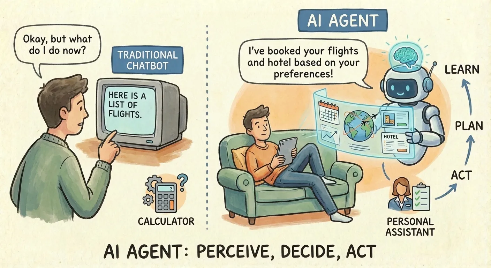
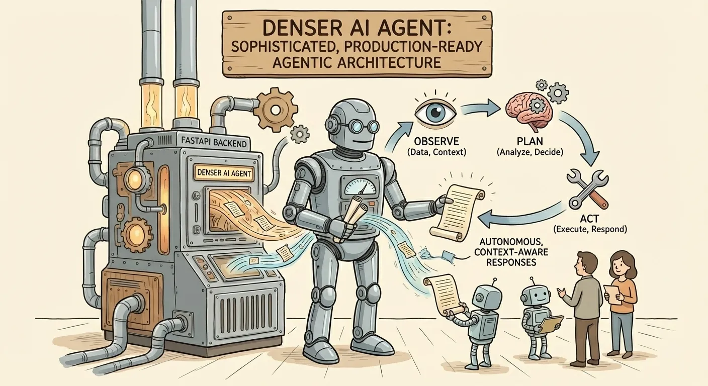
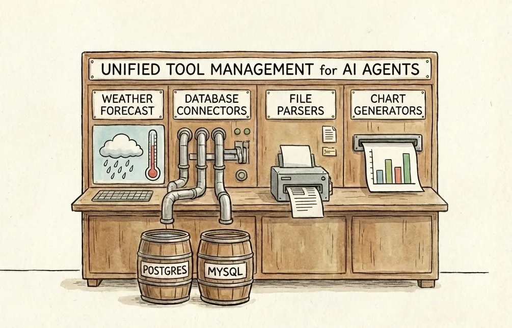
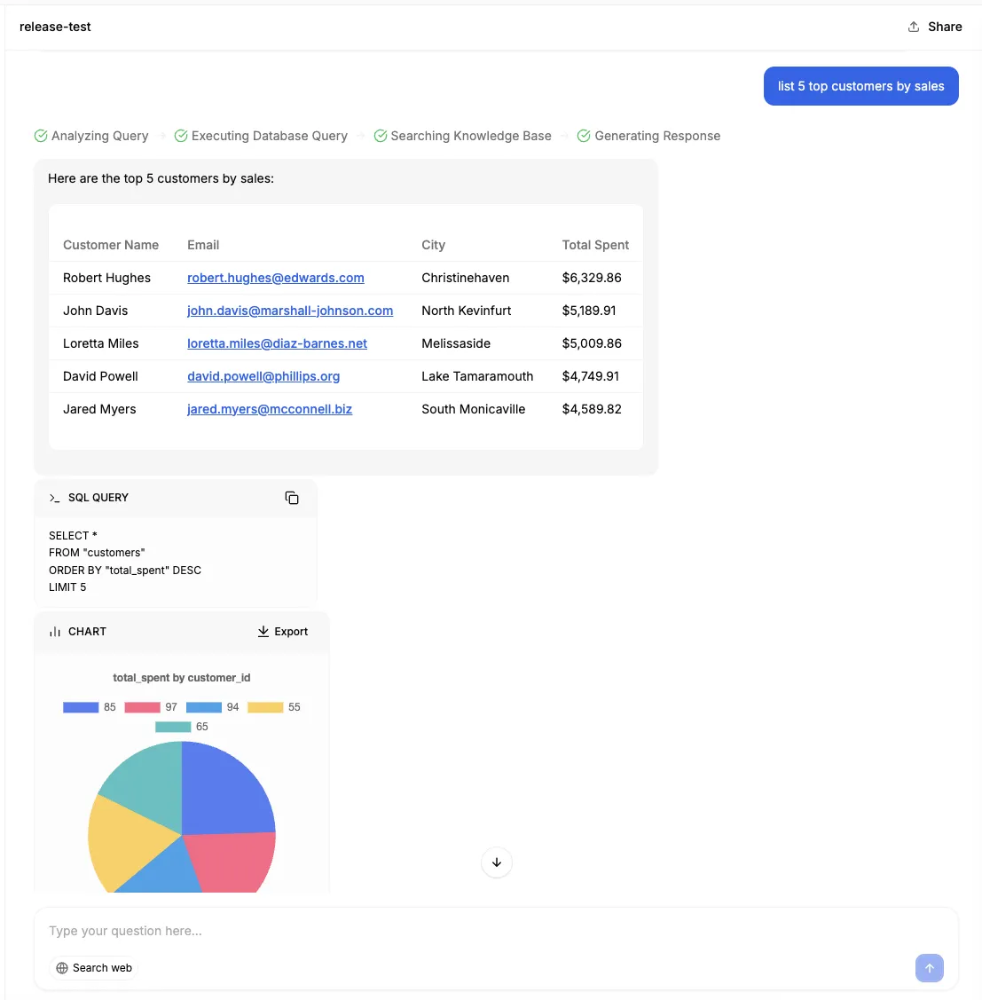
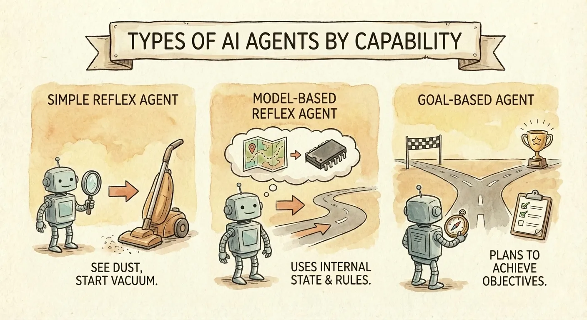
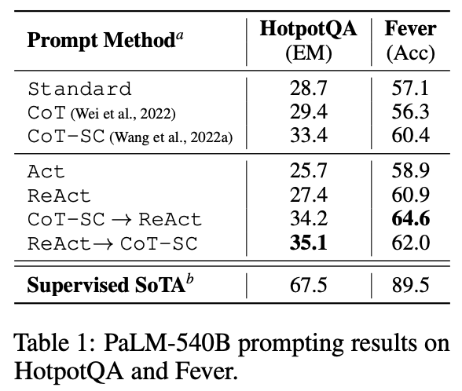
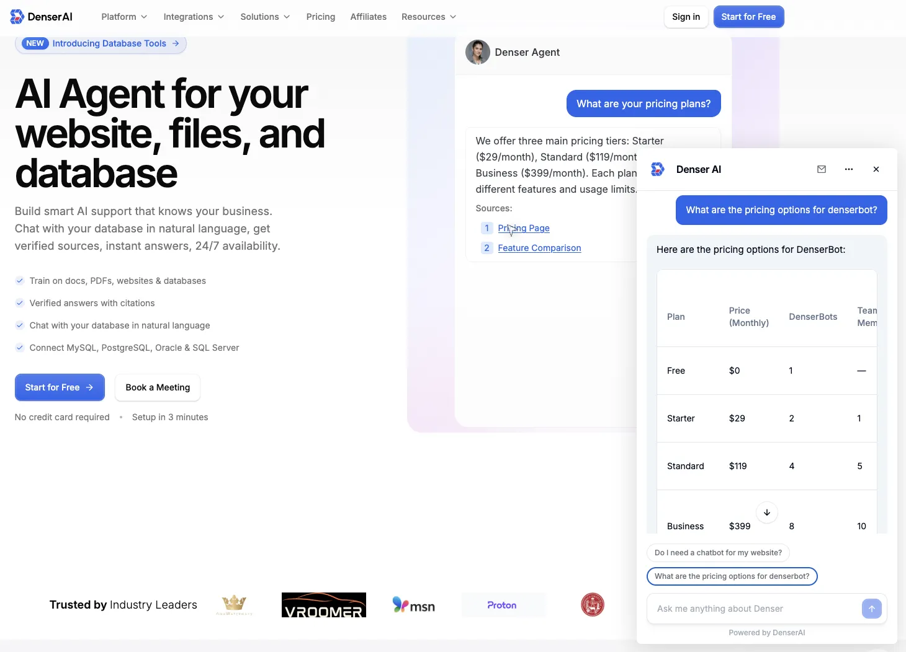
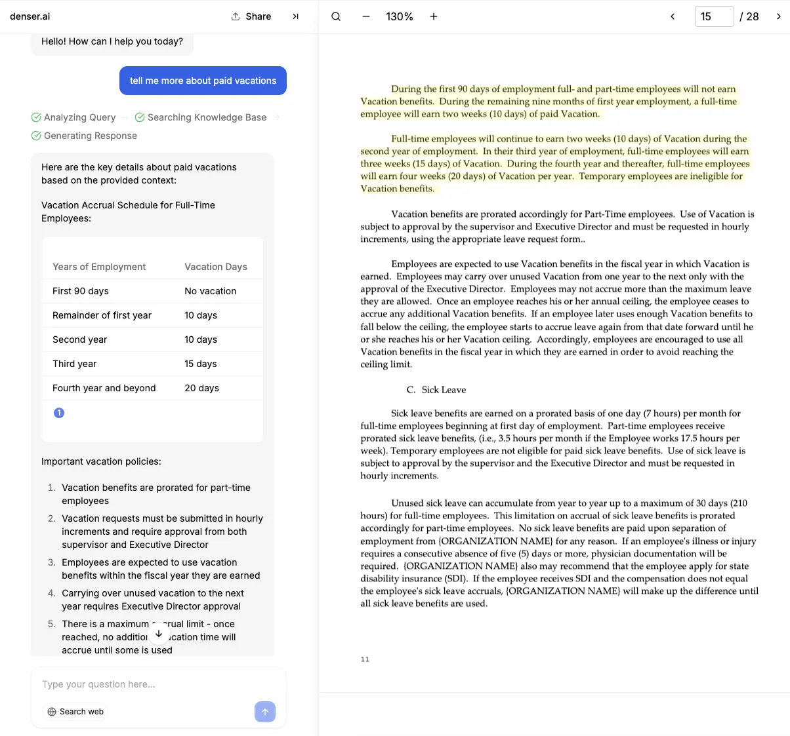
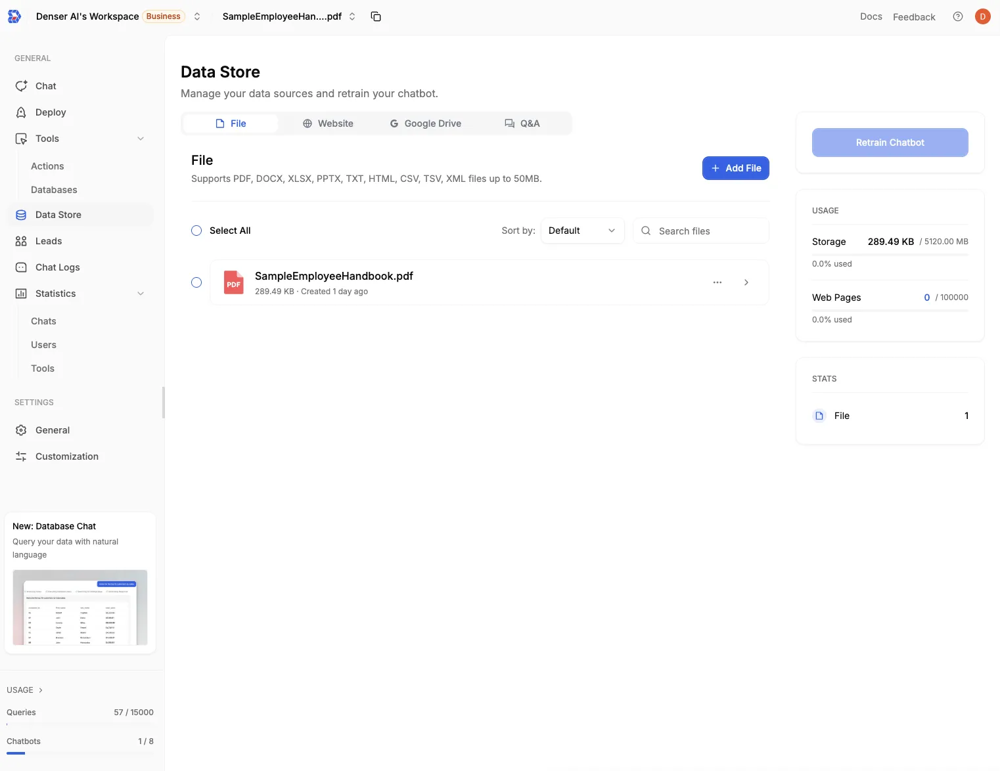
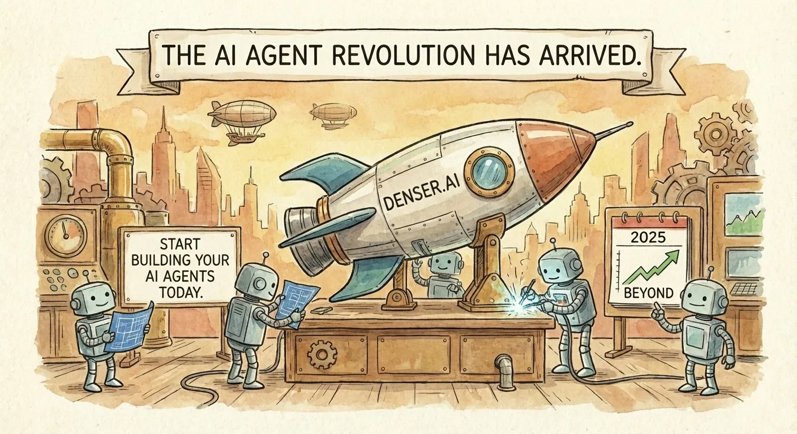

<link rel="canonical" href="https://denser.ai/blog/ai-agents-the-complete-guide-to-autonomous-ai-systems/" />

# AI Agents: The Complete Guide to Autonomous AI Systems

In the rapidly evolving landscape of artificial intelligence, **AI agents** are emerging as transformative tools that go beyond traditional chatbots and assistants. These intelligent agents are autonomous, goal-driven systems that can act independently, learn from experience, and adapt to dynamic environments—distinguishing them from traditional AI models. These autonomous systems can perceive their environment, reason through complex problems, and take actions to achieve specific goals—all with minimal human intervention. As we navigate 2025, AI agents are not just a buzzword; they represent a paradigm shift in how businesses automate workflows, enhance decision-making, and drive innovation. AI agents offer practical solutions that improve efficiency, security, and customer engagement, making them essential tools for modern businesses and industries.

This comprehensive guide explores the fundamentals of AI agents, their underlying theory, real-world applications, leading companies, and key research advancements. We will also touch on the AI agent's underlying architecture and decision-making workflows. Whether you're a developer, business leader, or AI enthusiast, understanding AI agents is essential for unlocking their full potential—especially as no-code platforms make building them increasingly accessible. Expect AI agents to accomplish even more in the near future, as their evolving capabilities continue to impact software development, security, and collaborative processes across industries.

---

## Table of Contents

1. [What Are AI Agents?](#what-are-ai-agents)
2. [AI Agents vs. Traditional AI Systems](#ai-agents-vs-traditional-ai-systems)
3. [How AI Agents Work: The Architecture](#how-ai-agents-work-the-architecture)
4. [Types of AI Agents by Capability](#types-of-ai-agents-by-capability)
5. [Key Research and Theoretical Foundations](#key-research-and-theoretical-foundations)
6. [Industry Applications of AI Agents](#industry-applications-of-ai-agents)
7. [Benefits and Challenges of AI Agents](#benefits-and-challenges-of-ai-agents)
8. [Conclusion](#conclusion)
9. [References and Further Reading](#references-and-further-reading)

---

## What Are AI Agents?

AI agents represent a revolutionary advancement in artificial intelligence technology. Unlike traditional AI systems that simply respond to prompts, **AI agents are autonomous software systems that can perceive their environment, make decisions, and take actions to achieve specific goals**—often with minimal human intervention. Unlike simple reflex agents, advanced AI agents can maintain an internal model of the world, pursue long-term objectives, and adapt their strategies based on feedback.

Think of the difference between a traditional chatbot and an AI agent as the difference between a calculator and a personal assistant. A chatbot tells you what to do; an AI agent actually does it for you. An AI agent can autonomously complete tasks and execute tasks, such as planning a vacation by researching destinations, comparing prices, and booking hotels—all while learning from your preferences to make better recommendations over time.

Despite their autonomy, AI agents still require human supervision to ensure ethical compliance and effective operation. Human users play a crucial role in overseeing AI agent activities, providing guidance, and evaluating performance to maintain trust and alignment with organizational goals.

### Key Characteristics of AI Agents

AI agents exhibit several defining characteristics that set them apart:

- **Autonomy**: Operating independently to break down tasks, make decisions, and adapt in real-time without constant human oversight, especially in dynamic environments.
- **Goal-Orientation**: Focusing on predefined objectives while optimizing for efficiency and maximum utility, often by maximizing a utility function.
- **Reasoning and Planning**: Using advanced AI models to think through problems, create action plans, and handle exceptions, and make informed decisions based on available data.
- **Memory**: Maintaining both short-term context and long-term knowledge to personalize interactions and improve over time.
- **Tool Use**: Connecting to external APIs, databases, and services to take real-world actions beyond text generation, often leveraging natural language processing to interact with external systems.
- **Learning and Adaptation**: Improving performance through feedback, experiences, and reinforcement learning.
- **Collaboration**: Working in multi-agent systems to handle complex workflows that require coordination.

### The Economic Impact

According to [McKinsey](https://www.mckinsey.com/capabilities/tech-and-ai/our-insights/the-economic-potential-of-generative-ai-the-next-productivity-frontier), the development of AI agents could help unlock up to **$4.4 trillion in annual economic value** from generative AI use cases. As Microsoft's Jared Spataro puts it, "Think of agents as the new apps for an AI-powered world." Businesses can achieve significant cost savings by deploying AI agents, as they streamline workflows, reduce operational expenses, and boost productivity.

The rise of AI agents is driven by advancements in generative AI and large language models (LLMs), enabling them to handle everything from customer service queries to supply chain optimization, including routine tasks across industries. By 2025, the market for AI agents is projected to grow at a **45% CAGR**, becoming integral to enterprise operations as organizations increasingly use them to automate routine tasks and automate complex tasks, leading to greater efficiency.

## **AI Agents vs. Traditional AI Systems**

To truly unlock the power of AI agents, it helps to understand how they differ from earlier generations of AI—from basic chatbots to modern virtual assistants. While all three interact with users, their **levels of autonomy, intelligence, and adaptability** vary dramatically. Unlike chatbots and assistants, AI agents are capable of performing tasks autonomously, often managing complex operations without direct human intervention.

| Feature | Traditional Chatbots | AI Assistants | AI Agents |
|--------|----------------------|---------------|-----------|
| **Autonomy** | Require constant human input | Respond to user requests | Operate independently with minimal oversight |
| **Decision-Making** | Follow predefined rules | Offer recommendations | Make dynamic, context-aware decisions |
| **Learning** | Static with little adaptation | Some personalization | Continuously learn and improve over time |
| **Task Complexity** | Simple, single-step tasks | Moderately complex tasks | Complex, multi-step workflows |
| **Tool Use** | Limited or no external access | Basic integrations | Connect to APIs, databases, and services |
| **Interaction Style** | Reactive to triggers | Reactive to prompts | Proactive and goal-driven |
| **Memory** | Session-only memory | Limited context retention | Short- and long-term memory |

**The key difference is simple but powerful:** AI agents don't just assist—they **take action**. They can initiate tasks, pursue objectives over extended periods, adapt their strategies based on results, and improve through continuous feedback. This shift from passive response to active execution is what makes AI agents a true leap forward in intelligent systems, especially when automating repetitive tasks to improve efficiency. In software development, for example, a coding agent is a specialized AI agent designed to automate coding tasks such as code generation, debugging, and reworking code, streamlining workflows and boosting productivity.

## How AI Agents Work: The Architecture

At their core, AI agents draw from principles in artificial intelligence, robotics, and cognitive science. Agent technology forms the foundation of modern AI agent architectures, enabling advanced reasoning, planning, and decision-making across diverse domains.

They operate on a **perceive-reason-act loop**: sensing the environment, processing information, and executing decisions. Model based agents play a crucial role in this loop by utilizing internal models to simulate environments, enhance reasoning, and improve planning capabilities.

Using AI agents in real-world applications offers significant benefits, such as automating tasks, improving efficiency, and enhancing security, and following best practices ensures optimal integration and performance.

### The Five Core Components of AI Agents

Most AI agents comprise five essential components:

1. **Memory Module**: This stores information about the environment, tasks, and previous actions. By analyzing past interactions, AI agents can learn from previous experiences to improve their performance and adapt to new situations.

2. **Reasoning Engine**: This is the "brain" of the agent, responsible for making decisions based on goals, rules, and available data.

3. **Learning and Reflection**: AI agents use machine learning techniques to adapt and improve over time. They can identify patterns in data and behavior, allowing them to refine their strategies and become more effective with experience.

4. **Tool Integration**: Agents often connect with external tools, APIs, or databases to gather information or execute actions. In many cases, multiple AI agents collaborate and integrate their tools to handle complex workflows more efficiently.

5. **Communication Interface**: This allows the agent to interact with users or other systems, often through natural language or structured protocols.

### The Observe-Plan-Act Cycle

AI agents operate through a continuous cycle that mirrors human problem-solving:

1. **Observe**: The agent collects information from its environment—user inputs, sensor data, API responses, or database queries. It maintains context across conversations and multi-step operations.

2. **Plan**: Using the foundation model, the agent evaluates the situation, considers available tools, and creates a plan of action. It prioritizes tasks based on goals and constraints.

3. **Act**: The agent executes its plan by calling APIs, running code, sending communications, or delegating to other agents. It monitors results and adjusts course as needed.

This cycle is self-reinforcing—agents continuously analyze how their actions have changed the environment and learn to be more effective over time.

### Retrieval-Augmented Generation (RAG)

A key architectural advancement is **retrieval-augmented generation (RAG)**, which enhances AI agents by fetching relevant context from large knowledge bases before generating responses.

The **Dense Passage Retriever (DPR)** paper introduces a dual-encoder framework using BERT to embed questions and passages for efficient semantic retrieval. DPR outperforms traditional BM25 keyword matching by **9-19% in top-20 accuracy**, enabling AI agents to ground responses in accurate, external knowledge. This reduces hallucinations and improves reliability in open-domain tasks.

RAG-enabled agents can:
- Access up-to-date information beyond their training data
- Provide citations and sources for their responses
- Handle domain-specific queries with enterprise knowledge bases
- Maintain accuracy on factual questions

### The Architecture of Denser AI Agent

The **Denser AI Agent** exemplifies a sophisticated, production-ready implementation of the agentic architecture described above. Built around a robust **FastAPI** backend, it orchestrates a seamless **observe-plan-act loop** to deliver autonomous, context-aware responses.

Key architectural highlights include:

*   **Multi-Provider Foundation Models:** At its core, the Denser agent is model-agnostic, integrating with top-tier LLMs like **OpenAI (GPT-4o)**, **AWS Bedrock (Claude)**, and **Google Gemini**. This flexibility allows the "brain" of the agent to be tailored to specific performance or compliance needs.
*   **Advanced RAG Pipeline:** Denser implements a high-performance Retrieval-Augmented Generation system, which ensures that the foundation model receives the most relevant context. This grounding significantly reduces hallucinations.
*   **Observe-Plan-Act Loop:** The agent follows a clear lifecycle for each request:
    *   **Observe:** It first analyzes the user's query, rewriting it to resolve ambiguities and retrieving relevant conversation history.
    *   **Plan & Act:** A **Unified Tool Manager** evaluates the query to select the appropriate tool—whether it's executing a SQL query, fetching web search results, or analyzing uploaded files.
    *   **Reflect:** The agent processes the tool's output (e.g., query results, file content) and synthesizes a final response, citing its sources for transparency.
*   **Unified Tool Management:** The agent's capabilities are extensible through a centralized manager that handles diverse tools, from weather forecast, database connectors (Postgres, MySQL) to file parsers and chart generators. This allows the agent to go beyond text generation and perform concrete data analysis tasks.

For example, if a chatbot is connected to a sales database which consists of customer orders, the Denser AI Agent can answer queries such as "list top 5 customers by sales" in the following screenshot. It automatically generates and executes the SQL query, retrieves the results, and formats them into a clear response. In addition, it can create visualizations like pie charts to enhance data comprehension.

## Types of AI Agents by Capability

Drawing from established AI classifications, agents range from simple to advanced:. An intelligent agent is an autonomous system capable of perceiving its environment, reasoning, and taking actions to achieve specific goals, often leveraging AI technologies.

The simplest type, known as simple reflex agents, act solely based on current percepts without considering the history or future consequences. However, unlike simple reflex agents, more advanced agents can maintain internal models, pursue goals, or even optimize utility.

In multi-agent systems or advanced applications, intelligent agents are used in complex domains such as healthcare, emergency response, and transportation. For example, self driving cars are a real-world application where intelligent agents enable autonomous vehicle navigation, obstacle avoidance, and real-time decision-making to improve safety and efficiency.

#### Simple Reflex Agents
Act based on current perceptions and predefined rules. They respond to specific conditions with predetermined actions.
- **Example**: A linting tool that applies coding standards based on detected patterns, or a thermostat responding to temperature changes.

#### Model-Based Reflex Agents
Maintain an internal model of the world, considering past actions and predicting future states. They can handle partially observable environments where not all information is immediately available.

#### Goal-Based Agents
Work toward specific objectives, making decisions that move them closer to their goals. They can consider multiple paths and select the most effective approach.
- **Example**: AI-powered code completion in IDEs like GitHub Copilot that aims to complete the developer's intended code.

#### Utility-Based Agents
Evaluate different outcomes and choose actions that maximize utility or benefit. They can balance multiple objectives simultaneously and make trade-offs.
- **Example**: A bug prioritization system that weighs severity, impact, and developer workload.

#### Learning Agents
Improve their performance over time by learning from experiences and feedback. They adapt to new situations and user preferences through machine learning techniques.
- **Example**: Recommendation systems that refine suggestions based on user behavior.

#### Hierarchical Agents
Organized in tiers where higher-level agents decompose tasks and assign them to lower-level specialists. Each agent runs independently and reports to supervisors.

#### Multi-Agent Systems (MAS)
Multiple agents that interact to solve problems or achieve shared objectives. They can collaborate, coordinate, or even compete based on context.
- **Example**: Autonomous vehicle fleets coordinating to avoid traffic and prevent collisions.

#### Enterprise RAG Agents (Hybrid Model)
Advanced knowledge retrieval systems that combine reactive responses with goal-based reasoning, integrating multiple data sources and tools for comprehensive business intelligence.

**Denser AI Agent** exemplifies this category as a sophisticated **hybrid reactive-goal-based agent** that seamlessly integrates:

- **Reactive Intelligence**: Immediate contextual responses using retrieval-augmented generation (RAG) from enterprise knowledge bases
- **Goal-Based Tool Orchestration**: Dynamic selection and execution of specialized tools—database queries, file analysis, web search, and data visualization
- **Multi-Modal Processing**: Intelligent handling of PDFs, spreadsheets, documents, and structured data with automatic format detection
- **Adaptive Reasoning**: Context-aware query rewriting and conversation management across multi-turn interactions

This hybrid approach enables organizations to deploy agents that can both respond instantly to knowledge queries and execute complex analytical workflows—from generating business reports to analyzing customer data and creating interactive visualizations—all within a secure, enterprise-grade architecture.

## Key Research and Theoretical Foundations

The current wave of AI agents is built on foundational research from academia and industry labs. Understanding these papers provides insight into how agents work and where they're heading.

### ReAct: Reasoning and Acting (2022)

The **ReAct (Reasoning + Acting) framework**, introduced by Yao et al. at Princeton and Google, is perhaps the most influential paradigm for building AI agents. The key insight is that LLMs can generate both reasoning traces and task-specific actions in an interleaved manner.

ReAct prompts LLMs to alternate between:
- **"Thinking"**: Generating verbal reasoning traces
- **"Acting"**: Taking actions like searching databases or calling APIs

The reasoning traces help the model track progress, handle exceptions, and update plans, while actions allow interaction with external information sources.

On benchmarks like HotPotQA (question answering) and Fever (fact verification), ReAct outperformed both pure reasoning (chain-of-thought) and pure acting approaches. Crucially, it reduces hallucination by grounding decisions in external data rather than relying solely on the model's internal knowledge.

### Chain-of-Thought Prompting (2022)

Developed by Jason Wei et al. at Google, **chain-of-thought (CoT) prompting** demonstrated that LLMs can perform complex reasoning by breaking problems into intermediate steps. This foundational technique underpins the planning capabilities of modern AI agents. When combined with tool use (as in ReAct), CoT enables agents to tackle multi-step tasks that require both reasoning and action.

### Dense Passage Retrieval (DPR, 2020)

The **Dense Passage Retriever** paper by Karpukhin et al. introduces a dual-encoder framework for efficient semantic retrieval that's foundational for RAG in AI agents.

Key contributions:
- Uses BERT-based encoders for questions and passages
- Achieves 78.4% top-20 accuracy on Natural Questions (vs. 59.1% for BM25)
- Enables agents to fetch accurate contexts without hallucinations
- Only requires ~1,000 training examples to outperform BM25

DPR's retrieval techniques enhance agent reliability by grounding responses in verified external knowledge.

### Generative Agents: Simulating Human Behavior (2023)

Park et al. at Stanford introduced **Generative Agents**—AI agents that simulate believable human behavior. Their architecture stores complete records of experiences in natural language, synthesizes memories into higher-level reflections, and retrieves them dynamically to plan behavior.

In a Sims-like simulation, 25 agents demonstrated emergent social behaviors: spreading information, maintaining relationships, and coordinating events. One agent even organized a Valentine's party that other agents attended. This research showed that LLM-powered agents with memory and planning can exhibit remarkably human-like interactions.

### Reflexion: Learning from Mistakes (2023)

Noah Shinn et al. at Northeastern University developed **Reflexion**, a framework for verbal reinforcement learning in agents. Rather than updating model weights, agents store verbal feedback about what went wrong and use it to guide future attempts. This enables rapid learning from failures without expensive retraining.

### Voyager: Open-Ended Exploration (2023)

From NVIDIA and collaborators, **Voyager** demonstrated an agent that could autonomously explore and learn in Minecraft. It features:
- An automatic curriculum for setting goals
- Iterative prompting for creating new skills
- A skill library for storing and reusing learned behaviors

Voyager significantly outperformed other approaches like AutoGPT and Reflexion on Minecraft tasks, showing the power of cumulative skill learning.

### Toolformer and WebGPT

These papers established that LLMs can learn to use external tools effectively:
- **Toolformer** (Schick et al., 2023) showed models could teach themselves to call APIs
- **WebGPT** (Nakano et al., 2021) demonstrated browser-assisted question answering

These capabilities form the foundation of agent tool use today.

### AutoGPT and BabyAGI (2023)

Proof-of-concept projects like **AutoGPT** (Toran Bruce Richards) and **BabyAGI** (Yohei Nakajima) captured public imagination by demonstrating AI systems that could autonomously pursue goals, create subtasks, and execute multi-step plans. While these early projects had reliability issues, they proved the viability of autonomous agent architectures and sparked massive investment in the space.

## Industry Applications of AI Agents

AI agents are revolutionizing industries by automating complex processes and augmenting human capabilities. Here are the key application areas with concrete examples:By combining their specialized capabilities, multiple AI agents can collaborate to tackle complex tasks that would be difficult for a single agent or human alone. Here are the key application areas with concrete examples:

When implementing AI solutions, organizations should follow best practices for deploying AI agents, including ensuring control, compliance, data security, transparency, scalability, and ethical considerations throughout the deployment process.

It is also essential to prioritize responsible AI when managing and supervising AI agents, ensuring ethical standards, privacy, and fairness are maintained in all applications.

### Customer Service and Support

Customer service represents the most mature application of AI agents. According to CB Insights, two-thirds of surveyed organizations are using or plan to use AI agents in customer support within the next 12 months.

**Impact metrics**:
- McKinsey research shows 14% increase in issue resolution per hour
- 9% reduction in handling time
- Sierra AI's agents reduced response times by 50% for clients like Sonos
- Salesforce Agentforce chatbots reduce costs by 10x

These agents can resolve customer queries autonomously, open and close tickets, and hand off complex cases to human agents while maintaining 24/7 availability.

### Knowledge Management

Knowledge management agents transform scattered enterprise information into unified, searchable repositories. These agents connect to websites, documents, and databases to provide instant answers to employee questions through natural language queries.

**Impact metrics**:
- Reduce information search time by up to 80%
- Provide 24/7 access to institutional knowledge
- Eliminate knowledge silos across departments
- Enable rapid employee onboarding and training

**Applications**: Employee onboarding, technical support documentation, sales enablement, and compliance policy access. Knowledge management agents like **Denser AI** excel at making organizational knowledge instantly accessible through intelligent retrieval and contextual understanding.

### Software Development

Coding agents represent one of the fastest-growing segments. They can generate code, review pull requests, debug issues, and even complete entire development projects.

**Key players and achievements**:
- GitHub's Copilot and Copilot Workspace leverage multi-agent systems for planning, coding, and testing
- Cognition AI's Devin ("the world's first AI software engineer") grew ARR from $1M to $73M in 9 months
- Anysphere's Cursor reached $500M ARR
- Lenovo reports up to 15% productivity improvements with software engineering agents

### Healthcare

Healthcare AI agents tackle clinical documentation, revenue cycle operations, call centers, and virtual triage.

**Applications**:
- Treatment planning and drug management assistance
- Emergency response and disaster location mapping from social media
- Clinical study report drafting (35% time efficiency gains reported by BCG)
- Patient interaction and appointment scheduling (Hippocratic AI)
- 40+ healthcare partnerships for testing and deployment

### Financial Services

Financial services represent the most crowded vertical for AI agents, with applications spanning:

- **Financial research**: Boosted.ai, Wokelo
- **Insurance sales and support**: Alltius, Indemn
- **Wealth advisory**: Finny AI, Powder
- **Fraud detection and market monitoring**
- **Loan underwriting automation**

BCG reports one global bank reduced customer interaction costs by 10x using AI virtual agents.

### Legal Services

Harvey AI has emerged as a leader in legal AI agents, raising $300M at a $5B valuation. Legal agents go beyond answering questions—they can handle entire workflows from document review to predictive case analysis. The company doubled its sales force in six months, indicating strong enterprise demand.

### Marketing and Sales

Marketing agents can design, test, and iterate campaigns based on real-time data.

**Results**:
- BCG reports a CPG company reduced marketing content costs by 95%
- Speed improved 50x—publishing in one day what took four weeks
- Sales agents handle inbound calls, qualify leads, generate quotes, and send orders to backend systems

### Manufacturing and Industrial

Industrial AI agents optimize processes and equipment—including control systems, robots, and industrial machines—with minimal human intervention.

**Applications**:
- Predictive maintenance
- Quality control and defect detection
- Supply chain optimization
- Route optimization for logistics (25% cycle time reduction)

### Multi-Agent Systems in Action

In multi-agent systems, AI agents collaborate for intricate workflows:
- Coordinating autonomous vehicle fleets
- Enterprise data analysis across departments
- Complex software development pipelines
- Research and development acceleration

## Benefits and Challenges of AI Agents

### Key Benefits

- **Increased Productivity & Cost Reduction**: Agents automate repetitive tasks and work 24/7, with BCG reporting 10x cost reductions in customer service for major banks
- **Scalability**: Agents can be rapidly deployed without hiring constraints, adapting to demand fluctuations
- **Consistent Quality**: Standardized processes reduce variability and human errors
- **Complex Problem Solving**: Agents combine reasoning with tool use to tackle multi-step challenges

### Key Challenges

- **Accuracy Concerns**: Up to 20% of agent outputs may require human verification due to potential hallucinations
- **Security & Privacy**: Agents handling sensitive data need robust access controls and governance frameworks
- **Integration Complexity**: Connecting agents to legacy systems requires significant technical expertise
- **Accountability Issues**: Determining responsibility when agents make errors remains challenging

## Conclusion

AI agents represent a fundamental shift in how we interact with artificial intelligence. Moving beyond chatbots that merely respond to prompts, agents can reason, plan, and take autonomous action to complete complex tasks. The technology has matured rapidly—from academic research papers in 2022-2023 to billion-dollar startups with proven enterprise traction in 2025.

For businesses, the question is no longer whether to adopt AI agents, but how quickly and in which areas. Customer service and software development have emerged as the most mature applications, but every industry is finding use cases—from healthcare and legal services to manufacturing and finance.

Success requires more than technology adoption. Organizations must invest in change management, build new skills for supervising AI agents, and establish robust governance frameworks. Those who get it right will capture significant competitive advantages through improved productivity, reduced costs, and enhanced customer experiences.

### Build Powerful AI Agents with Denser.ai

**Denser.ai** is a comprehensive no-code platform for building sophisticated AI agents that excel at customer support and knowledge management. Our unified tool ecosystem enables agents to perform complex workflows without technical expertise.

**Powerful Agent Capabilities**:
- **Smart Knowledge Management**: RAG-powered agents that connect to databases, documents, and enterprise systems for instant information retrieval
- **Customer Support Tools**: Lead collection, custom form submissions, and continuous learning through Q&A pair generation
- **Database Intelligence**: Direct chat with databases, SQL query generation, and automated chart creation for data visualization
- **File Processing**: Smart file analysis across PDFs, documents, spreadsheets with contextual understanding
- **External Integrations**: Weather forecasts, web search, and custom API connections
- **Safety & Compliance**: Built-in guardrails, access controls, audit logging, and enterprise security features
- **Multi-LLM Support**: Choose from OpenAI, Anthropic Claude, and Google Gemini with model-specific optimizations

The AI agent revolution has arrived. [**Start building your AI agents on Denser.ai today**](/u/auth/login) to stay ahead in 2025 and beyond.

---

## References and Further Reading

### Foundational Research Papers

1. **Yao, S. et al. (2022)**. "ReAct: Synergizing Reasoning and Acting in Language Models." *arXiv:2210.03629* — The foundational framework for combining reasoning and action in AI agents.

2. **Wei, J. et al. (2022)**. "Chain-of-Thought Prompting Elicits Reasoning in Large Language Models." *NeurIPS* — Established step-by-step reasoning in LLMs.

3. **Karpukhin, V. et al. (2020)**. "Dense Passage Retrieval for Open-Domain Question Answering." *Facebook AI* — Introduced dual-encoder retrieval for RAG systems.

4. **Park, J.S. et al. (2023)**. "Generative Agents: Interactive Simulacra of Human Behavior." *Stanford University* — Demonstrated emergent social behavior in LLM-powered agents.

5. **Shinn, N. et al. (2023)**. "Reflexion: Language Agents with Verbal Reinforcement Learning." *arXiv* — Framework for learning from verbal feedback.

6. **Wang, G. et al. (2023)**. "Voyager: An Open-Ended Embodied Agent with Large Language Models." *NVIDIA* — Open-ended exploration and skill learning.

7. **Schick, T. et al. (2023)**. "Toolformer: Language Models Can Teach Themselves to Use Tools." *Meta AI* — Self-taught tool use in LLMs.

8. **Nakano, R. et al. (2021)**. "WebGPT: Browser-assisted question-answering with human feedback." *OpenAI* — Browser-based information retrieval.

### Industry Resources

- **IBM Think**: "What Are AI Agents?" — [ibm.com/think/topics/ai-agents](https://www.ibm.com/think/topics/ai-agents)
- **Google Cloud**: "What Are AI Agents?" — [cloud.google.com/discover/what-are-ai-agents](https://cloud.google.com/discover/what-are-ai-agents)
- **AWS**: "What Are AI Agents?" — [aws.amazon.com/what-is/ai-agents](https://aws.amazon.com/what-is/ai-agents)
- **Microsoft**: "AI Agents — What They Are and How They'll Change Work" — [news.microsoft.com](https://news.microsoft.com/source/features/ai/ai-agents-what-they-are-and-how-theyll-change-the-way-we-work/)
- **McKinsey**: "What Is an AI Agent?" — [mckinsey.com/featured-insights/mckinsey-explainers](https://www.mckinsey.com/featured-insights/mckinsey-explainers/what-is-an-ai-agent)
- **BCG**: "AI Agents" — [bcg.com/capabilities/artificial-intelligence/ai-agents](https://www.bcg.com/capabilities/artificial-intelligence/ai-agents)
- **GitHub Blog**: "What Are AI Agents and Why Do They Matter?" — [github.blog/ai-and-ml](https://github.blog/ai-and-ml/generative-ai/what-are-ai-agents-and-why-do-they-matter/)
- **Lilian Weng**: "LLM Powered Autonomous Agents" — [lilianweng.github.io](https://lilianweng.github.io/posts/2023-06-23-agent/)

### Market Research

- **CB Insights**: AI Agent Market Map and Startup Rankings
- **Forbes AI 50**: Annual ranking of top AI companies
- **Sequoia Capital**: AI 50 2025 analysis