<link rel="canonical" href="https://denser.ai/blog/ai-knowledge-bases-compared-notebooklm-denser/" />

# NotebookLM vs Denser AI Chat: Which AI Knowledge Assistant Is Right for You?

When it comes to AI-powered knowledge assistants, two platforms have emerged as standout options for different use cases: **Google NotebookLM** and **Denser AI Chat**. Both are examples of artificial intelligence knowledge assistants, leveraging advanced AI to transform documents into intelligent, conversational knowledge bases. This article will help you choose the best AI for your needs. While both excel at transforming documents into intelligent, conversational knowledge bases, they serve distinctly different needs and workflows. In addition, we will highlight the best features of each platform.

**NotebookLM** revolutionizes personal research and learning with its innovative content generation features—from podcast-style audio overviews to interactive mind maps, study flashcards, and professional slide decks. Integrated within the Google ecosystem, it's designed for individuals who want to deeply understand and synthesize information from their documents.

**Denser AI Chat** takes a broader approach, bridging the gap between personal research tools and business applications. As a tool designed for both individual and business use, it excels at generating accurate answers grounded in your specific knowledge base and enables direct chat with your data through natural language database queries, with visual PDF highlighting that helps you find the needle in haystacks of information. Teams can deploy these intelligent knowledge bases as websites, chatbots, or internal tools, while maintaining strong citation practices that researchers appreciate.

This comparison examines both platforms across key dimensions: data ingestion capabilities, content generation features, citation quality, deployment options, collaboration features, and pricing. Each tool reflects different design philosophies—Google's focus on enhancing individual learning versus Denser's emphasis on scalable knowledge sharing—making the choice highly dependent on your specific workflow and goals.

## Quick Glance: NotebookLM vs Denser AI Chat

Before diving into detailed analysis, here's how these two platforms compare across key use cases:

| Use Case | NotebookLM | Denser AI Chat | Winner |
|----------|-------------|----------------|---------|
| **Personal research & learning** | ✅ Excellent | ✅ Very Good | **Tie** - Different strengths |
| **Content generation** | ✅ Audio, video, mind maps, flashcards | ❌ Text-only responses | **NotebookLM** |
| **Team collaboration** | ❌ Individual use only | ✅ Shareable deployments | **Denser** |
| **Customer service** | ❌ No deployment options | ✅ Website widgets, lead capture | **Denser** |
| **Database connectivity** | ❌ No SQL access | ✅ Direct database queries | **Denser** |
| **Website crawling** | ❌ Manual page-by-page upload | ✅ Full domain crawling | **Denser** |
| **Citation quality** | ✅ Excellent inline citations | ✅ Smart highlights in PDFs | **Tie** - Both excellent |
| **Ease of setup** | ✅ Upload and go | ✅ 5-minute guided setup | **Tie** - Both simple |
| **Cost** | ✅ Generous free tier | ⚠️ Limited free tier | **NotebookLM** |

### At a Glance Summary

| Platform | Best For | Ideal Users |
|----------|----------|-------------|
| **NotebookLM** | Individual research, studying, content synthesis | Students, researchers, writers, journalists |
| **Denser AI Chat** | Team knowledge sharing, customer support, business intelligence | SMBs, research teams, support teams |

## Data Ingestion: Different Philosophies for Different Needs

How you get your information into these platforms reveals their fundamental design philosophies and intended use cases.

### NotebookLM: Curated Research Approach

**Google NotebookLM takes a fundamentally different approach, focusing on user-uploaded sources rather than automated crawling**. This deliberate limitation actually enhances its research-focused mission.

**Supported Sources:**
- PDFs (up to 200MB each)
- Google Docs, Slides, Sheets
- Word documents and PowerPoint files
- Audio files and YouTube URLs
- Website content (individual pages/URLs)
- Images and charts (November 2025 addition)

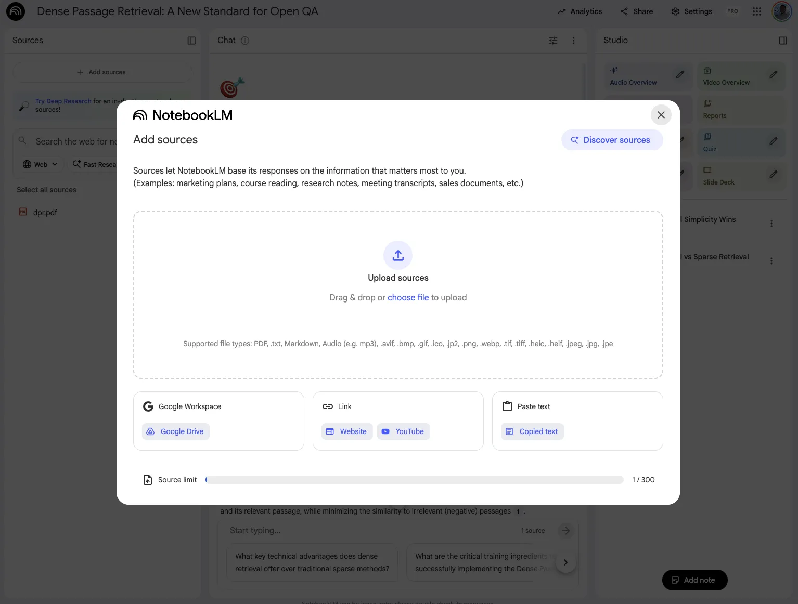

**Capacity Limits:**
- **Free tier:** 50 sources per notebook, 100 notebooks total
- **Plus subscribers:** 300 sources across 500 notebooks
- **Maximum:** 25 million words per notebook

This curated approach encourages thoughtful source selection—perfect for researchers who want to build focused knowledge bases around specific topics or projects. You can mix research papers, lecture notes, and reference materials in one "notebook," creating a comprehensive research environment. For each new project or topic, you can create a new notebook and upload relevant documents, making it easier to organize your research and improve comprehension.

### Denser AI Chat: Business-First Scalability

**Denser AI Chat targets practical business deployment with the ability to crawl all web pages for a given domain, along with other automated capabilities designed for teams and organizations**. Its strength lies in generating accurate, grounded answers from vast knowledge bases while making it easy to locate specific information through visual highlighting—like finding a needle in a haystack.

**Supported Sources:**
- **Website crawling:** Handles hundreds of thousands of pages automatically
- **Document uploads:** PDF, Word, PowerPoint, CSV, TXT, HTML files
- **Google Drive integration:** Real-time sync with cloud storage
- **Database connectivity:** Direct SQL access to MySQL, PostgreSQL, Oracle, SQL Server
- **API integrations:** 6,000+ apps via Zapier

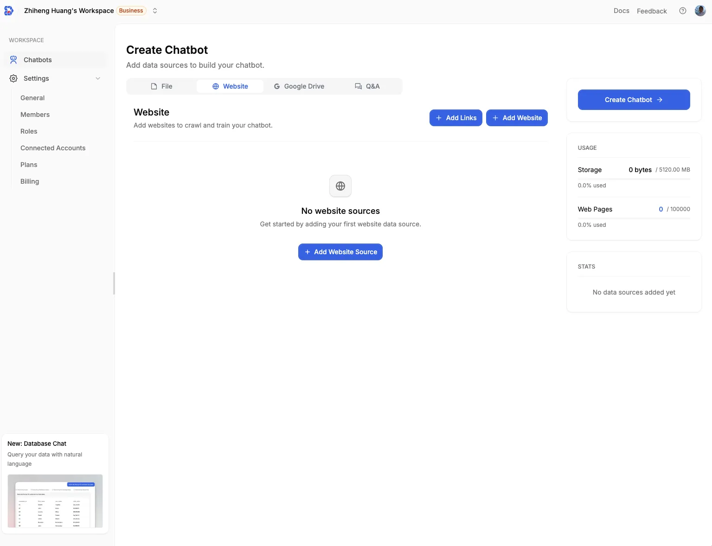

**Capacity Limits:**
- **Starter:** 1,500 monthly queries, basic document upload
- **Business:** 10,000 documents, unlimited website crawling
- **Maximum:** Tens of billions of words (vs NotebookLM's 25 million word limit)
- **Setup time:** Typically under 5 minutes with guided wizard

The business focus means Denser excels at ingesting existing company knowledge—from support documentation websites to internal databases—without requiring manual document-by-document uploads.

### Key Differences in Practice

| Feature | NotebookLM | Denser AI Chat |
|---------|-------------|-----------------|
| **Philosophy** | Curated research | Automated business knowledge |
| **Setup Style** | Manual, thoughtful selection | Automated crawling + uploads |
| **Best For** | Academic research, focused projects | Business documentation, team knowledge |
| **Automation** | Minimal (manual uploads) | High (website crawling, DB sync) |
| **Scale** | Medium (300 sources) | Large (10,000+ documents) |

> **Choose NotebookLM if:** You want to carefully curate sources for deep research and synthesis.
> **Choose Denser if:** You need to quickly ingest large amounts of existing business content.

## NotebookLM's Content Generation Features

**NotebookLM transforms your documents into multiple content formats** beyond simple Q&A. This unique capability sets it apart from other AI knowledge tools. Recent new features, such as video overview and enhanced audio overview capabilities, now allow users to experience content in more dynamic and interactive ways.

With NotebookLM, you can generate mind maps, concise summaries, and briefing documents that highlight key themes from your materials. The audio overview feature provides podcast-style summaries and enables a deep dive into your documents, while the video overview creates animated visual aids or slideshows to further enhance your understanding of complex topics.

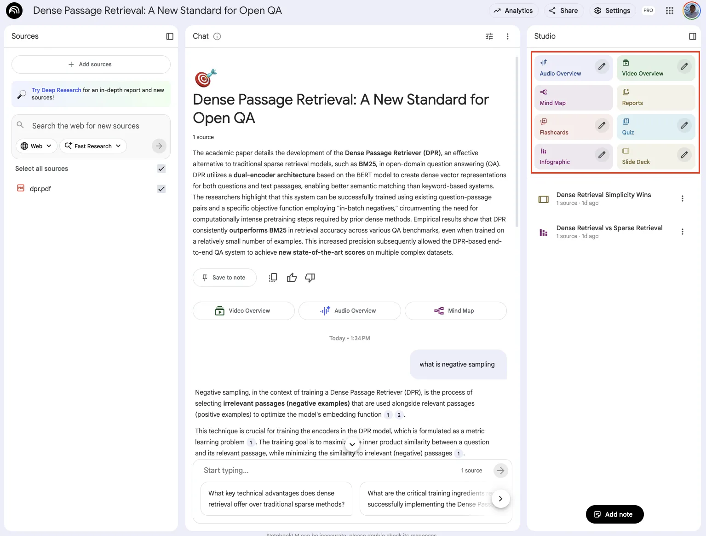

### Key Content Types

**Audio Overviews:** 10-20 minute podcast-style discussions between two AI hosts. Perfect for commuting or reviewing materials hands-free.

**Study Materials:** Automatically generates flashcards, practice quizzes, and study guides from your documents.

**Visual Content:** Creates mind maps, infographics, and professional slide presentations from your research.

**Research Reports:** Produces executive summaries, comparative analyses, and formal memos suitable for sharing.

These features help users allocate focus time and support focus work by organizing information efficiently, making it easier to dedicate uninterrupted periods to deep, productive tasks.

Below is an example of slide deck generation with NotebookLM:

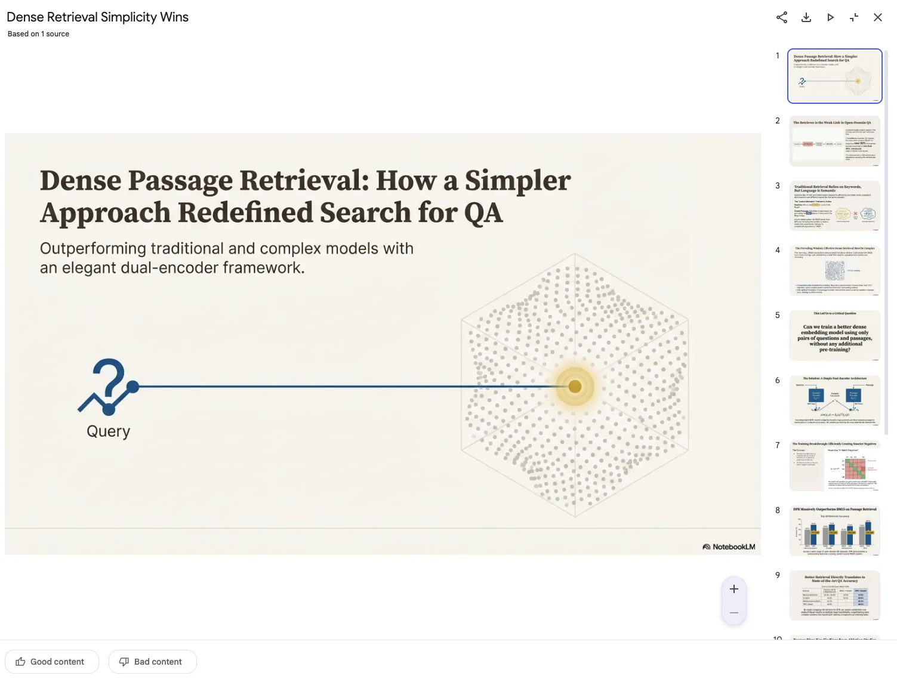

### Why This Matters

These features make NotebookLM ideal for:
- Students who need study materials in multiple formats
- Researchers synthesizing complex information
- Professionals who want to review content while multitasking
- Anyone who learns better through audio or visual content
- Users who need to manage individual tasks and organize tasks for study or research

### What Denser AI Chat Offers Instead

**Denser AI Chat focuses on delivering accurate, grounded answers from your specific knowledge base** rather than content generation:

- **Precise, cited responses** that are fully grounded in your uploaded documents and data
- **Visual PDF highlighting** that pinpoints exact sources, making it easy to find the needle in haystacks of information
- **Database query results** presented as tables and charts with full transparency
- **Customer service workflows** with lead capture forms
- **Team collaboration** through shareable, accurate knowledge bases

While Denser doesn't create podcasts or flashcards, it excels at providing reliable, source-backed answers that teams can trust and verify instantly.

## Citation Quality: Both Excel, Different Approaches

Both platforms deliver exceptional citation quality, but with different user experiences that reflect their target audiences.

### NotebookLM: Text-Based Academic Citations

**NotebookLM provides traditional academic-style citations** with numbered references and hover previews. Every response includes inline citations that display quoted text when hovered, and clicking navigates to the source passage.

**Key strengths:**
- **Source-only responses:** Uses only uploaded documents, not general knowledge
- **Academic formatting:** Familiar citation style for researchers
- **Precision control:** Select/deselect sources to control AI responses
- **Supports documentation needs:** Enables precise citation for supporting documents such as standard operating procedures, which are essential for streamlining workflows and ensuring consistency

### Denser AI Chat: Visual Highlighting in Original Documents

**Denser AI Chat takes a more intuitive approach by highlighting the exact text within the original PDF files**. This visual method generates accurate answers grounded in your knowledge base while making it effortless to find the needle in haystacks of information.

**Key strengths:**
- **Direct PDF highlighting:** See exact text highlighted in the original document
- **Accurate, grounded responses:** All answers are strictly based on your uploaded content
- **Needle-in-haystack precision:** Instantly locate specific information within vast document collections
- **More intuitive:** Visual approach is easier to verify than text-based citations
- **Source transparency:** Instantly see which document and which specific section
- **Business-friendly:** Quick verification for customer support and team use

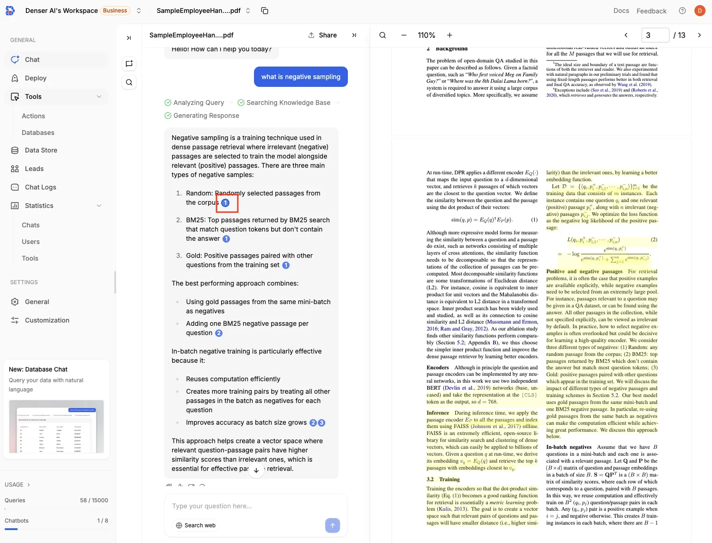

**Bottom line:** NotebookLM offers traditional academic citations; **Denser's visual highlighting in original PDFs generates more accurate, grounded answers while making it effortless to find the needle in haystacks of information**.

## Deployment and Sharing: Individual vs Team Needs

This is perhaps the starkest difference between these platforms—NotebookLM is designed for individual use, while Denser excels at team deployment and customer-facing applications.

### NotebookLM: Personal Research Workspace

**NotebookLM is fundamentally designed as a personal productivity tool** with limited sharing capabilities:

**Access Options:**
- **Web interface only:** Available at notebooklm.google.com
- **Mobile apps:** Basic functionality launched May 2025
- **No deployment options:** Cannot be embedded on websites or integrated with messaging platforms
- **Limited sharing:** Can share individual notebook URLs with view-only access
- **No public API:** Enterprise customers get API access via Google Cloud only

**Collaboration Features:**
- **Notebook sharing:** Share read-only access to specific notebooks
- **Export options:** Download content as documents or presentations
- **Team notebooks:** Multiple users can contribute sources to shared notebooks (Plus tier)

This design reflects NotebookLM's mission: enhancing individual learning and research rather than building customer-facing tools.

### Denser AI Chat: Built for Deployment and Teams

**Denser AI Chat is architected from the ground up for team collaboration and customer-facing deployment**:

**Deployment Options:**
- **Website widgets:** Embeddable chat widgets with one line of JavaScript code
- **Customization:** Custom colors, button sizing, and branding
- **Platform integrations:** WordPress and Shopify
- **Messaging platforms:** Slack, Telegram, and WhatsApp integration via Zapier
- **API access:** Full REST/GraphQL APIs for custom integrations

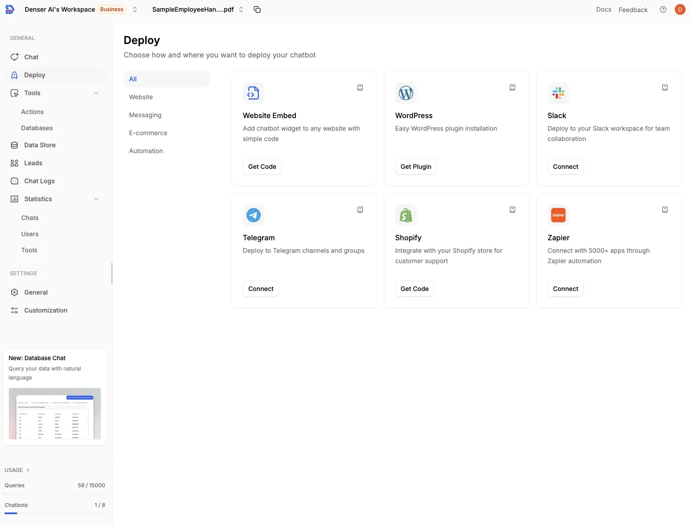

**Team Collaboration Features:**
- **Multi-user management:** Team members can collaborate on knowledge bases
- **Access controls:** Different permission levels for team members
- **Analytics dashboard:** Track usage, common questions, and performance metrics
- **Lead capture:** Built-in forms for customer information collection

### Use Case Implications

| Scenario | NotebookLM | Denser AI Chat |
|----------|-------------|-----------------|
| **Individual research project** | ✅ Perfect | ⚠️ Overkill but capable |
| **Team knowledge sharing** | ❌ Very limited | ✅ Excellent |
| **Customer support** | ❌ No deployment | ✅ Built for this |
| **Website integration** | ❌ Not possible | ✅ Easy setup |
| **Academic collaboration** | ⚠️ Share-only | ✅ Full collaboration |

> **Choose NotebookLM if:** You primarily work solo and need deep content generation features.
> **Choose Denser if:** You need to share knowledge with teams or deploy customer-facing solutions.

## Business Intelligence and Database Connectivity: A Clear Winner

When it comes to connecting AI knowledge bases to structured data sources like databases, there's a clear divide between these platforms.

### NotebookLM: Document-Focused Only

**NotebookLM cannot connect to databases**, limiting its utility for business intelligence applications despite recently adding Google Sheets support. It's designed specifically for document-based research:

- **No SQL access:** Cannot query databases directly
- **Spreadsheet support:** Can analyze uploaded Google Sheets and Excel files
- **Document analysis only:** Focus remains on PDFs, papers, and text sources

This limitation is intentional—NotebookLM prioritizes deep document synthesis over broad data integration.

### Denser AI Chat: Built for Business Intelligence

**Denser AI Chat uniquely offers direct SQL database connectivity** across major database platforms, making it a powerful tool for conversational business intelligence:

**Supported Databases:**
- **Relational databases:** MySQL, PostgreSQL, Oracle, SQL Server
- **Cloud platforms:** AWS RDS, Azure SQL Database, Google Cloud SQL, Amazon Aurora
- **Security features:** AES-256 encryption, read-only access requirements, audit trails

**How it works:**
1. Users ask questions in plain English ("Show me the top 10 customers by sales")
2. The system generates optimized SQL queries with JOINs, GROUP BY, and sorting
3. Results are displayed both as answers and the actual SQL query for transparency
4. Charts and visualizations can be automatically generated from query results

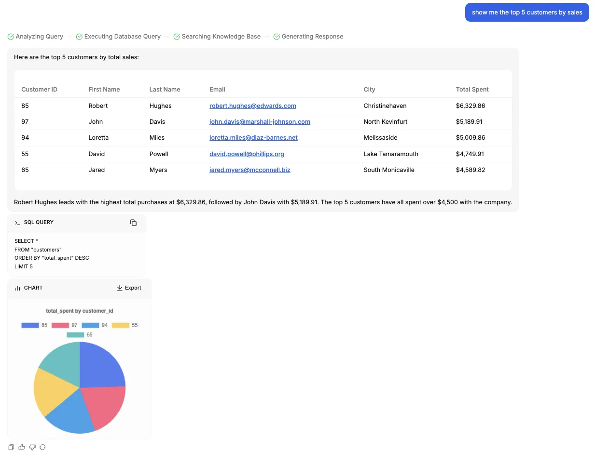

**Business applications:**
- **Sales analysis:** "Which products are performing best this quarter?"
- **Customer insights:** "Show me customers who haven't purchased in 6 months"
- **Operational metrics:** "What are our peak traffic hours by region?"

This capability positions Denser as more than a knowledge base—it's a conversational business intelligence tool that can unify document knowledge with structured data insights.

## Lead Capture and Customer Engagement

### NotebookLM: Zero Business Features

**NotebookLM includes no lead capture functionality**—no forms, no email collection, no CRM integrations. This reflects its design as a research and learning tool rather than a customer-facing business application.

### Denser AI Chat: Complete Lead Generation Solution

**Denser AI Chat provides comprehensive lead generation capabilities** built specifically for customer-facing deployments:

**Lead Capture Features:**
- **Built-in forms:** Automatically collect names, email addresses, and contact information during conversations
- **Custom fields:** Configure what information to collect (company, role, phone, etc.)
- **Conversation triggers:** Lead forms can appear based on specific conversation patterns
- **Lead qualification:** AI can ask follow-up questions to qualify prospects

**CRM Integration:**
- **Zapier connectivity:** 6,000+ applications including HubSpot, Salesforce, Zendesk
- **Real-time sync:** Leads automatically flow into your existing CRM workflows
- **Google Sheets:** Simple spreadsheet integration for basic lead tracking
- **Email notifications:** Instant alerts when new leads are captured

**Customer Service Applications:**
- **Support ticket creation:** Automatically create tickets in Zendesk
- **Escalation workflows:** Smart handoff to human agents based on conversation context
- **Customer satisfaction:** Built-in feedback collection and rating systems

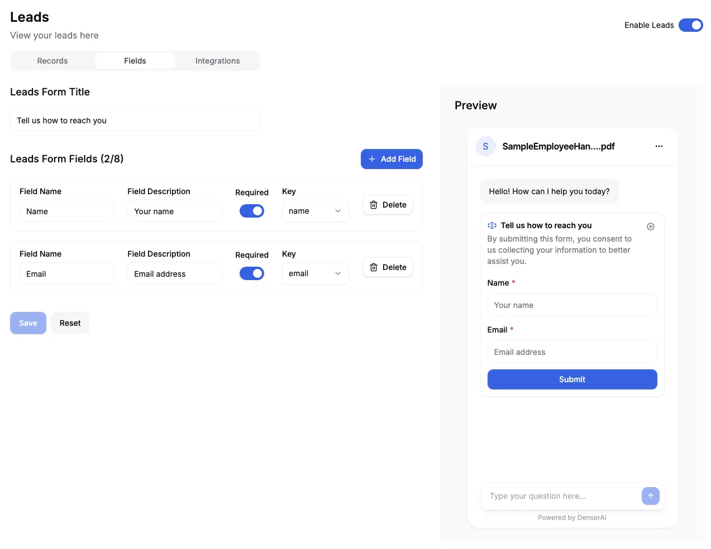

This makes Denser particularly valuable for organizations that want their knowledge base to also serve as a customer acquisition and support tool.

## Analytics and Usage Insights: Understanding Your Knowledge Base

Understanding how users interact with your AI knowledge base is crucial for improvement, but these platforms take very different approaches to analytics.

### NotebookLM: Basic Personal Analytics

**NotebookLM provides minimal analytics**, reflecting its personal productivity focus:

- **Personal history:** Can save and search your own conversation history (2025 addition)
- **Shared notebook metrics:** Basic usage stats (Plus tier only, requires 4+ shared users)
- **Export capabilities:** Third-party browser extensions needed for detailed exports
- **No admin dashboard:** Individual users only see their own activity

The analytics reflect NotebookLM's design philosophy: personal productivity doesn't require extensive tracking.

### Denser AI Chat: Comprehensive Business Analytics

**Denser AI Chat offers enterprise-grade analytics dashboards** designed for teams and businesses:

**Usage Metrics and Business Intelligence:**
- **Query tracking:** Count and categorize all user queries
- **Session analytics:** Track user engagement and conversation flows
- **User behavior:** Understand how different user types interact with your knowledge base
- **Performance trends:** Historical data to optimize content and responses
- **Team collaboration:** See which knowledge areas need attention

**Data Retention:**
- **Starter tier:** 30 days of query logs
- **Standard tier:** 90 days of comprehensive logs
- **Business tier:** 360 days of detailed analytics

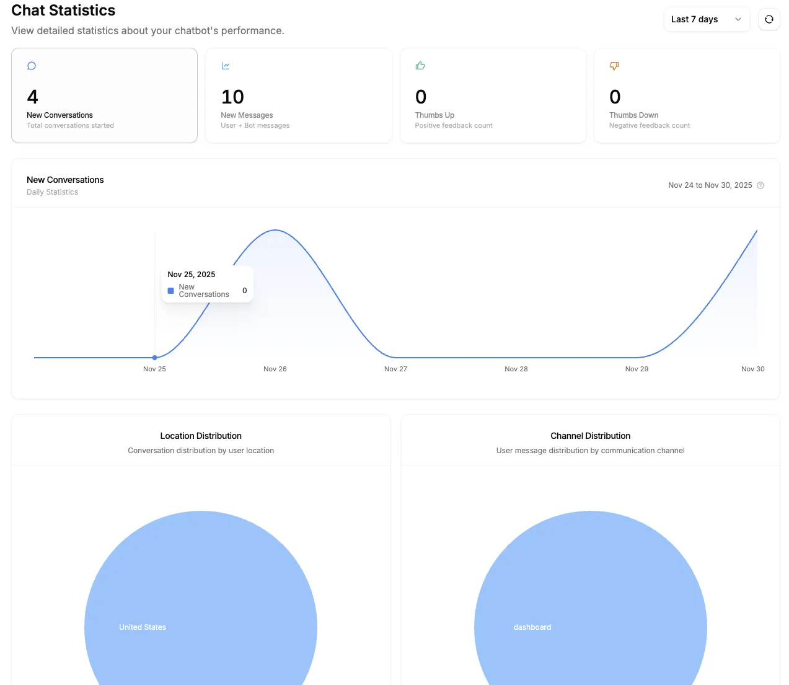

These analytics enable continuous improvement of your knowledge base, helping teams understand what users need and where the AI performs well or struggles.

## Pricing: Value-Driven Options for Different Needs

While NotebookLM focuses on generous free access for individual users, **Denser AI Chat delivers exceptional value through powerful business features that quickly pay for themselves**. The development teams behind these platforms have over a decade of experience in AI and knowledge management, ensuring reliable and advanced solutions.

### NotebookLM: Individual-Focused Free Tier

NotebookLM offers substantial free access designed for personal research and learning:

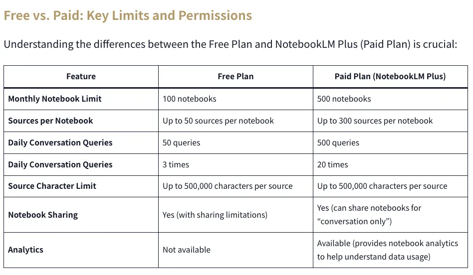

The generous free tier makes NotebookLM accessible for students and researchers, though it lacks business deployment capabilities.

### Denser AI Chat: High-Value Business Solution

**Denser AI Chat's pricing reflects the significant business value it delivers** through deployment capabilities, lead generation, and team productivity improvements:

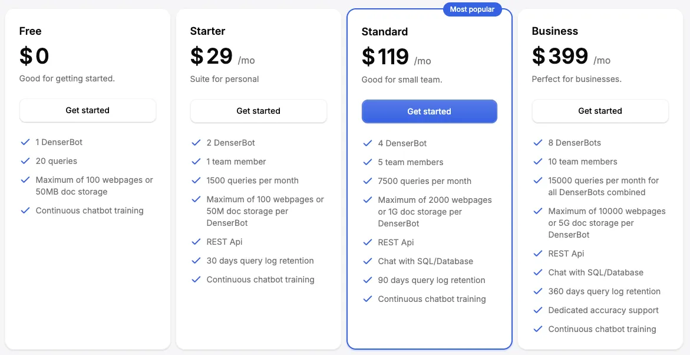

**Why Denser's pricing makes sense for businesses:**

- **ROI through lead capture:** Even capturing a few qualified leads per month can justify the cost
- **Team productivity gains:** Faster knowledge access and automated customer support reduce operational costs
- **Database connectivity:** Eliminates need for separate business intelligence tools
- **Deployment flexibility:** Replace expensive custom chatbot development with ready-to-use solutions
- **Scalable analytics:** Understanding user behavior and optimizing knowledge bases drives continuous improvement
- **Source citation transparency:** Visual highlighting in original PDF files provides crucial transparency for business decisions and customer trust

## What Each Platform Does Best—and Where to Choose Wisely

After extensive comparison, it's clear that **both platforms excel in their respective domains**, and the choice depends entirely on your specific needs and use cases. Compared to other AI tools on the market, NotebookLM and Denser stand out by offering more human-like, automated, and connected solutions, especially in areas like productivity, scheduling, and task management.

### NotebookLM: The Research and Learning Champion

**NotebookLM revolutionizes individual research and learning** with capabilities no other platform matches:

**Unique Strengths:**
- **Content generation mastery:** Audio overviews, mind maps, flashcards, quizzes, and slide decks
- **Academic-grade citations:** Inline numbered citations with hover previews and direct navigation
- **Source-only responses:** Zero hallucination risk by exclusively using uploaded documents
- **Generous free tier:** Substantial value for students and researchers
- **Thoughtful curation:** Encourages focused, quality source selection

**Best use cases:**
- Students preparing for exams with generated flashcards and audio reviews
- Researchers synthesizing literature across multiple papers
- Writers organizing reference materials and generating outlines
- Journalists creating backgrounders from interview transcripts and documents
- Academics collaborating on shared research projects

**Limitations to consider:**
- No deployment or sharing beyond basic notebook URLs
- Limited team collaboration features
- Cannot connect to databases or live business systems
- Personal productivity focus limits business applications

### Denser AI Chat: The Productivity-Boosting Business Solution

**Denser AI Chat delivers accurate, source-grounded answers that dramatically improve team productivity** while enabling powerful business applications:

**Unique Strengths:**
- **Accurate, cited responses:** Every answer includes visual source highlighting in original PDFs, ensuring reliability and transparency
- **Productivity acceleration:** Teams get instant access to organizational knowledge without time-consuming document searches
- **Team deployment:** Share knowledge bases as websites, chatbots, or internal tools
- **Database connectivity:** Direct SQL access for conversational business intelligence
- **Lead capture:** Built-in forms and CRM integration for customer acquisition
- **Business analytics:** Comprehensive usage tracking and performance optimization
- **Automation ready:** 6,000+ app integrations via Zapier for workflow automation

**Best use cases:**
- **Knowledge workers** who need fast, verified answers from company documentation to boost daily productivity
- **Customer support teams** providing accurate responses with clear source attribution
- **Research teams** sharing findings with stakeholders through deployed knowledge bases
- **Sales teams** capturing and qualifying leads through intelligent chat
- **Operations teams** querying databases through natural language
- **Growing organizations** needing scalable internal knowledge management

**Productivity Impact:**
- **Eliminates document hunting:** Instant answers from vast knowledge bases
- **Ensures accuracy:** Visual source citations prevent misinformation and build confidence
- **Reduces training time:** New team members get immediate access to institutional knowledge
- **Streamlines decision-making:** Quick access to relevant information accelerates business processes

**Limitations to consider:**
- Limited free tier (20 queries/month)
- No content generation features (audio, flashcards, presentations)
- Higher cost for advanced features

## When Each Platform Shines

**Choose NotebookLM if you primarily need:**
- Deep research and learning enhancement
- Individual productivity with rich content generation
- Academic-quality citations and source verification
- Cost-effective solution for students/researchers
- Focus on document synthesis rather than deployment

**Choose Denser AI Chat if you primarily need:**
- Team knowledge sharing and collaboration
- Customer-facing chatbot deployment
- Business intelligence with database connectivity
- Lead capture and customer engagement
- Analytics and performance optimization

**Consider both if:**
- You're a researcher who also needs to share findings with teams (use NotebookLM for research, Denser for sharing)
- Your organization has both individual research needs and business applications
- You want to compare approaches before committing to one platform

## Conclusion: Two Different Tools for Two Different Worlds

**NotebookLM and Denser AI Chat represent fundamentally different approaches to AI-powered knowledge management**, each optimized for distinct use cases and user types. Rather than competing directly, they serve complementary niches in the evolving AI landscape.

**NotebookLM has revolutionized personal research and learning** by creating something unprecedented: an AI that doesn't just answer questions about your documents but transforms them into rich, multimedia learning experiences. Its audio overviews, mind maps, flashcards, and academic-grade citations provide unmatched value for students, researchers, and writers who need to deeply understand and synthesize information. The generous free tier makes it accessible to anyone, democratizing advanced AI research capabilities.

**Denser AI Chat bridges the gap between individual research tools and business applications**, delivering accurate answers grounded in your specific knowledge base with visual highlighting that helps teams find the needle in haystacks of information. It offers the citation quality and document analysis that researchers appreciate while adding team collaboration, deployment flexibility, and business intelligence capabilities that organizations need. Its ability to transform knowledge bases into customer-facing chatbots, connect to databases for conversational BI, and capture leads makes it valuable for teams and businesses looking to operationalize their accurate, source-backed knowledge.

Ultimately, the ideal solution depends on your specific needs and workflow, as each platform aligns differently with project goals and team requirements.