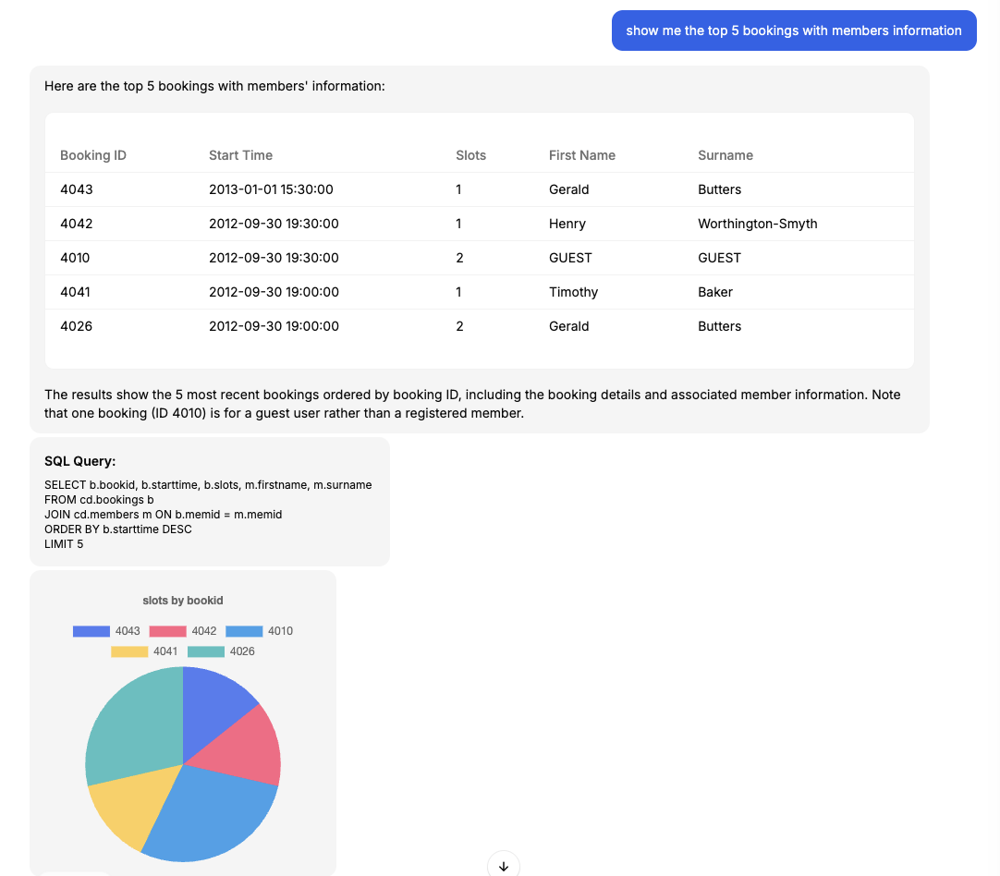
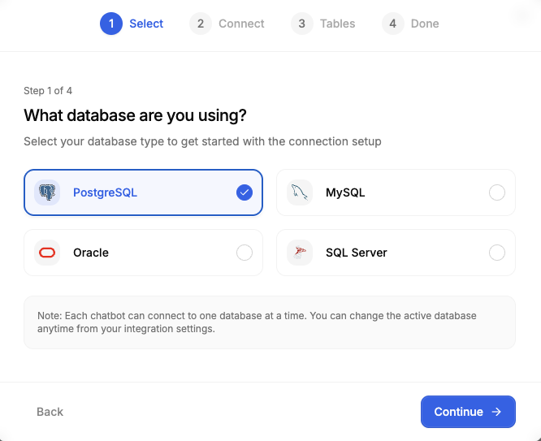
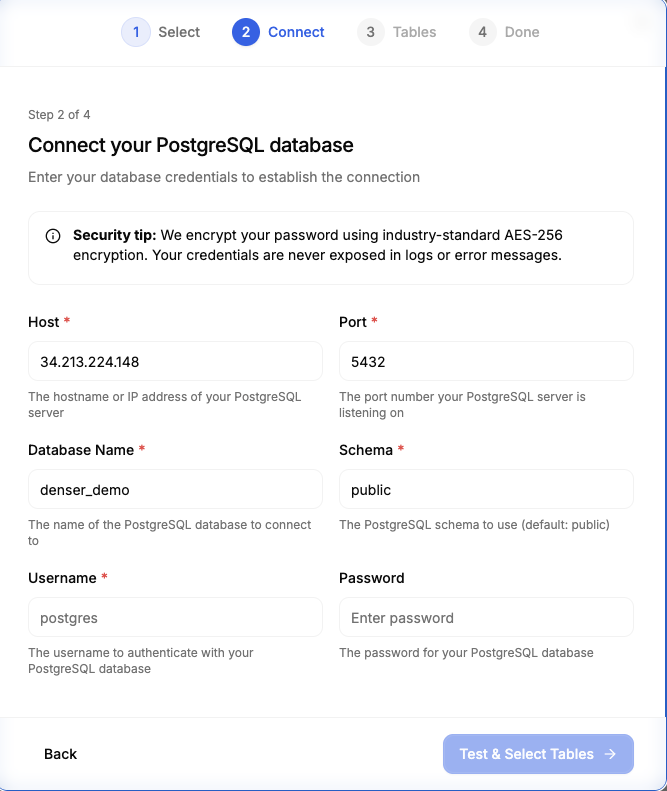
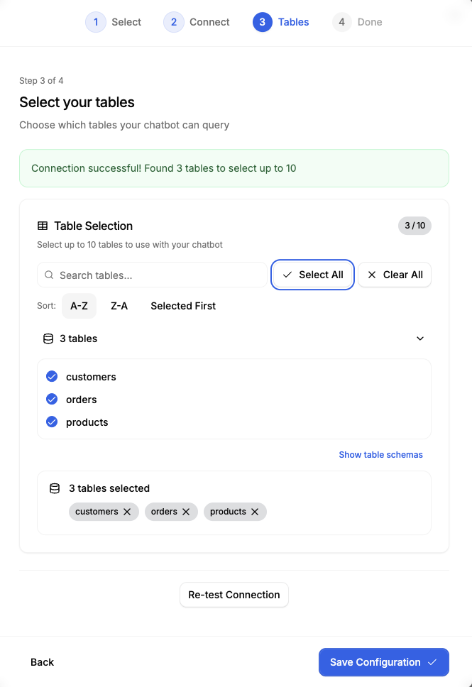
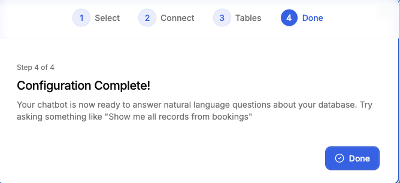
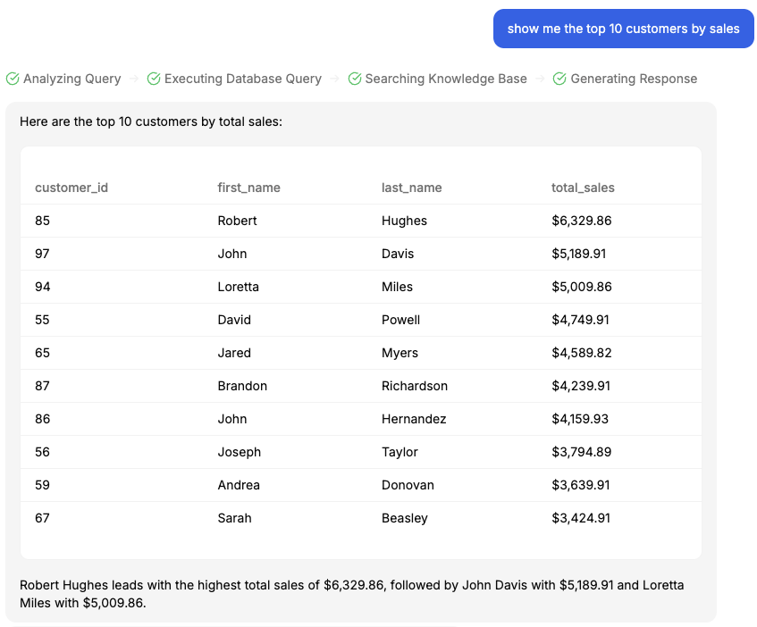
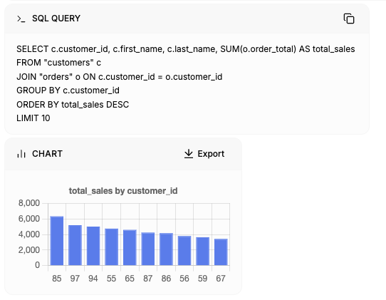
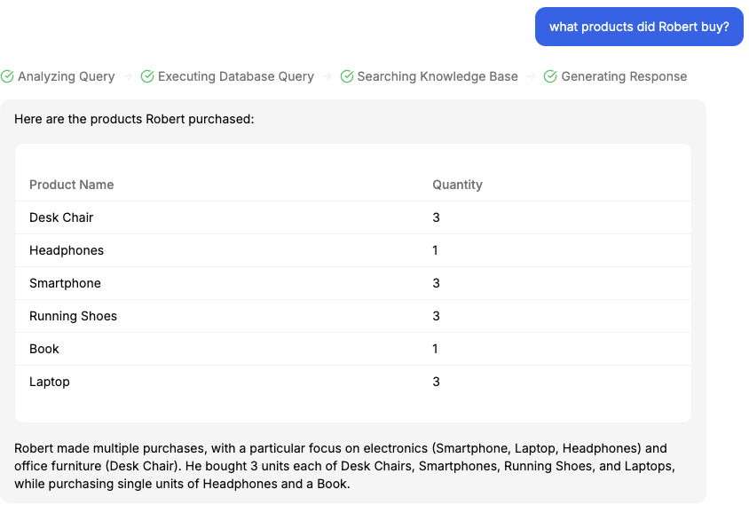
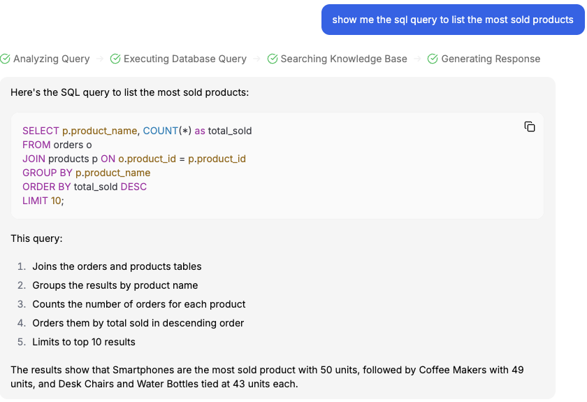

<link rel="canonical" href="https://denser.ai/blog/database-tools/" />

# How to Chat With Your Database: AI Chatbot to MySQL, PostgreSQL, Oracle & SQL Server Integration Guide

Connecting your **AI chatbot to database** systems transforms customer service from reactive to proactive. Instead of manual data lookups, your chatbot delivers instant, accurate answers from live business data stored in **MySQL**, **PostgreSQL**, **Oracle**, or **SQL Server** databases.

An **AI database chatbot** is a tool that enables users to chat with their data using natural language, making it easier for non-technical users to access and analyze information. A user friendly chat interface allows users to interact with databases without technical expertise, promoting a seamless and intuitive experience. By leveraging the OpenAI API and large language models, the chatbot can understand natural language queries and generate accurate SQL statements. The quality of source data and strong data engineering practices are essential to ensure reliable and accurate chatbot responses.


## What Are AI Chatbot Database Tools?

**AI chatbot database integration** enables your conversational AI assistant to connect directly to your company's database systems and respond to customer questions in real time — all using live data, with no coding required. The primary way users interact with the system is through the chatbot UI and interface, which provides an intuitive environment for entering queries, viewing results, and managing conversations. This powerful combination of **artificial intelligence and database connectivity** revolutionizes how businesses handle customer inquiries, internal operations, and data-driven decision making.


Rather than checking inventory or order details yourself, the chatbot looks it up in the database and gives a clear, direct answer through its user-friendly interface. The example below shows how that looks inside the Denser dashboard.

**"Show me the top 5 bookings with member information."**

Denser instantly processes this user input as a message, converting it into a structured request. The system uses this request to generate SQL queries, executes them against your database, and returns the results within seconds. The chatbot can generate responses based on user queries by sending requests to the database and displaying the retrieved data in the chatbot UI.



## Step-by-Step AI Chatbot Database Configuration Guide

Setting up your database connection is simple and takes less than 10 minutes by following these four easy steps:

### Step 1: Select Your Database Type

Choose the database that your company already uses. Denser supports the most popular database systems.



Supported databases include:
- **MySQL** - Most common for web applications and e-commerce
- **PostgreSQL** - Enterprise-grade with advanced analytics features  
- **Oracle** - Industry standard for large organizations
- **SQL Server** - Microsoft's solution for business applications

### Step 2: Configure Database Connection

Enter your database connection details securely. All credentials are encrypted with bank-level AES-256 encryption.



**Required Information:**
- **Host**: Your database server address (e.g., `db.company.com` or `192.168.1.100`)
- **Port**: Database port number (MySQL: 3306, PostgreSQL: 5432, SQL Server: 1433, Oracle: 1521)
- **Database Name**: The specific database to connect to
- **Username**: Database user with read-only permissions
- **Password**: Securely encrypted and never stored in plain text

**Security Best Practices:**
- Create a dedicated read-only user account for the chatbot
- Use connection strings with minimal required permissions
- Enable SSL/TLS encryption for the connection
- Restrict access by IP address if possible

### Step 3: Select Tables and Permissions

Choose exactly which tables your chatbot can access. This gives you complete control over your data.



**Table Selection Guidelines:**
- Start with 2-3 essential tables (orders, products, customers)
- Exclude sensitive data like passwords or payment details
- Choose tables that answer common customer questions
- You can add more tables later as needed
- Review table names, column names, and data types to ensure the right data is made available to the chatbot

### Step 4: Test and Activate

Verify your connection works correctly before going live.



**Testing Checklist:**
- ✅ Connection established successfully
- ✅ Tables accessible and loading
- ✅ Sample queries return expected results
- ✅ No sensitive data exposed
- ✅ Response times are acceptable

## Why Connect Your AI Chatbot to Live Database Systems?

Connecting your chatbot to a live database eliminates the gap between customer questions and your stored business knowledge. By providing access to real time data, the chatbot ensures users receive up-to-date answers. It performs data retrieval from the database and presents results in a human readable format, making information easy to interpret and act on. This closes the loop between what customers ask and what your data knows, freeing teams from constant lookups and giving users real answers in real time.

### Before AI Chatbot Database Integration

**Customer**: "Do you have the MacBook Pro 16-inch in stock?"

**Support Team**: Logs into inventory system → Checks stock → Responds to customer

**Time**: 5-10 minutes per inquiry  
**Cost**: $15-25 per support interaction  
**Customer Experience**: Frustrating wait times

### After AI Chatbot Database Integration

**Customer**: "Do you have the MacBook Pro 16-inch in stock?"

**AI Chatbot**: "Yes! We have 12 units available in Silver and Space Gray. Would you like to order?"

**Time**: 5 seconds  
**Cost**: $0.02 per automated interaction  
**Customer Experience**: Instant, accurate responses 24/7

## Real-World AI Chatbot Database Query Examples by Industry

Most businesses need instant access to their data, but writing SQL queries requires technical expertise and time. Providing the right context about your data helps the AI generate more accurate SQL queries. Here's what traditional database queries look like across different industries — and how **Denser's AI chatbot database integration** makes it effortless.

### The Traditional Challenge: Complex SQL Queries

#### E-commerce & Retail Operations

**❌ What You Previously Needed to Write:**

**Inventory Management Query:**
```sql
-- Question: "What products are running low on stock?"
SELECT 
    p.product_name,
    p.sku,
    i.current_stock,
    i.reorder_level,
    s.supplier_name,
    p.category
FROM products p
JOIN inventory i ON p.product_id = i.product_id
JOIN suppliers s ON p.supplier_id = s.supplier_id
WHERE i.current_stock <= i.reorder_level
ORDER BY i.current_stock ASC;
```

**Customer Order Analysis:**
```sql
-- Question: "Show me John Smith's order history with payment status"
SELECT 
    o.order_id,
    o.order_date,
    o.order_status,
    o.total_amount,
    p.payment_status,
    c.customer_tier,
    STRING_AGG(CONCAT(oi.quantity, 'x ', pr.product_name), ', ') as items
FROM orders o
JOIN customers c ON o.customer_id = c.customer_id
JOIN payments p ON o.order_id = p.order_id
JOIN order_items oi ON o.order_id = oi.order_id
JOIN products pr ON oi.product_id = pr.product_id
WHERE c.first_name = 'John' AND c.last_name = 'Smith'
GROUP BY o.order_id, o.order_date, o.order_status, o.total_amount, p.payment_status, c.customer_tier
ORDER BY o.order_date DESC;
```

### ✅ The Denser Way: Natural Language Database Queries

Instead of writing complex SQL, your customers and team members can simply ask questions in plain English. **Denser's AI chatbot database integration** instantly translates natural language into optimized SQL queries, automatically generating SQL code from user input and returning formatted results.

#### How Simple Questions Become Powerful Insights

**Customer Question:** *"Show me the top 10 customers by sales"*



**Result:** Complete customer sales ranking with detailed revenue breakdown by customer — Robert Hughes leads with $6,329.86, followed by John Davis with $5,189.91. No SQL expertise required.

Users can also review their conversation history to track previous queries and answers, making it easy to reference past interactions and maintain conversation continuity.

**Behind the Scenes**: For technical teams who want transparency, Denser also shows the actual SQL query it generated and executed. The system automatically created an optimized query with proper JOINs, GROUP BY clauses, and sorting — plus generated a chart for visual analysis.



**Customer Question:** *"What products did Robert buy?"*



**Result:** Detailed customer purchase history showing Robert's complete order breakdown — 3 smartphones, 3 laptops, 3 desk chairs, and more. Instant customer insights for personalized service.

---

**Customer Question:** *"Show me the SQL query to list the most sold products"*



**Result:** Auto-generated SQL query with execution results — smartphones top the list with 50 units sold, followed by coffee makers with 49 units. Perfect for technical teams who want to see the underlying queries.

### The Business Impact: From Technical Complexity to Conversational Simplicity

**Before Denser Database Integration:**
- ⏰ **Hours** to write and debug SQL queries
- 🔧 **Technical expertise** required for every data request
- 📊 **Limited access** to business insights
- 🐛 **Error-prone** manual query writing
- 💰 **High cost** of technical resources

**After Denser Database Integration:**
- ⚡ **5-second** responses to natural language questions
- 🗣️ **Anyone** can query data conversationally
- 📈 **Instant insights** available 24/7
- ✅ **Accurate results** with optimized SQL generation
- 💡 **Democratized data access** across all teams


## Real-Time Chatbot Use Cases by Department

### Sales Teams: Stop Wasting Time on Data Lookups

Your sales team spends hours digging through CRM systems and spreadsheets. Now they just ask the chatbot.

**What Sales Teams Can Ask:**

- "Pull up the deals set to close this quarter"
- "What's the pipeline value for the enterprise segment?"
- "Which accounts haven't been contacted in 30 days?"
- "What's our conversion rate by region?"
- "Show me the top 10 prospects by deal size"

**Result**: Sales reps spend 3+ hours per day selling instead of searching for data.

### HR & People Ops: Employee Self-Service

Employees can instantly check PTO balances, payroll info, and benefits without waiting for HR to respond.

**Common Employee Questions:**

- "How many days off do I have left again?"
- "When is my next performance review?"
- "What's my 401k contribution percentage?"
- "Who do I report travel expenses to?"
- "What's the org chart for the marketing team?"

**Result**: HR team handles 70% fewer routine inquiries.

### Finance Teams: Real-Time Business Intelligence

Finance teams get instant answers to budget questions without running custom reports or SQL queries.

**What Finance Can Query:**

- "How much of this quarter's budget have we already used?"
- "Which departments are spending faster than forecast?"
- "What's our cash position right now?"
- "Which clients brought in the most revenue this month?"
- "Show me expense trends by category"

**Result**: Financial reporting that used to take days now takes seconds.

### Operations: Inventory & Supply Chain Visibility

Operations managers monitor inventory levels, supplier orders, and logistics in real-time through natural language queries.

**Operations Questions:**

- "Show me products we've reordered more than twice this month."
- "Any suppliers missing expected delivery dates?"
- "Which items are moving slower than forecast?"
- "What's waiting to ship that's over three days old?"
- "Which warehouse has the most available space?"

**Result**: Proactive inventory management prevents stockouts and overstocking.


## Supported Database Systems for AI Chatbot Integration

Connect to any major database platform:

- **MySQL** - Common in e-commerce and web applications, quick to set up, and supported by nearly every hosting provider
- **PostgreSQL** - Enterprise-grade, advanced features, built for scale with extras like JSON queries, full-text search, and complex analytics.
- **Oracle** - Industry standard for large organizations that need reliability, scalability, and advanced security controls.
- **SQL Server** - Microsoft's trusted database solution. A natural fit for teams already using tools like Azure and Dynamics 365.

Denser also links smoothly to cloud-hosted databases such as AWS RDS, Azure SQL, and Google Cloud SQL.

These integrations provide powerful tools for developers and data teams, helping them choose the right tool for managing, querying, and integrating structured and unstructured data sources.

### Database Compatibility Overview

| 🗃️ Database Type | 🔌 Default Port | 🎯 Ideal Use Case | 📊 Popular Examples |
|---|---|---|---|
| **MySQL** | `3306` | E-commerce data, product inventory | Shopify, WooCommerce, Magento |
| **PostgreSQL** | `5432` | Enterprise analytics, BI dashboards | Internal reporting tools, Data warehouses |
| **Oracle** | `1521` | Enterprise ERP & CRM systems | SAP, Oracle Cloud, Enterprise apps |
| **SQL Server** | `1433` | Business apps on Microsoft stack | Dynamics 365, Power BI, .NET apps |

### ☁️ **Cloud Database Support**
✅ **AWS RDS** (MySQL, PostgreSQL, Oracle, SQL Server)  
✅ **Azure SQL Database** & **Azure Database for PostgreSQL**  
✅ **Google Cloud SQL** (MySQL, PostgreSQL, SQL Server)  
✅ **Amazon Aurora** (MySQL & PostgreSQL compatible)

## AI Chatbot Database Connection Troubleshooting Guide

### Common Connection Issues

**Connection Timeout:**
- Verify host address and port number
- Check firewall settings
- Ensure database server is running
- Test connection from same network first

**Authentication Failed:**
- Double-check username and password
- Verify user has required permissions
- Check if account is locked or expired
- Ensure user can connect from your IP address

**Permission Denied:**
- Grant SELECT permissions on required tables
- Check database-level access rights
- Verify schema permissions
- Test with a database client first

**SSL/TLS Issues:**
- Enable SSL if required by your database
- Update certificates if expired
- Check SSL mode compatibility
- Try with SSL disabled for testing (not recommended for production)

### Performance Optimization Tips

**For Large Databases:**
- Use read replicas to avoid impacting production
- Index frequently queried columns
- Limit result sets with appropriate WHERE clauses
- Consider data partitioning for time-series data

**Query Performance:**
- Add indexes on columns used in WHERE clauses
- Avoid SELECT * queries when possible
- Use LIMIT to restrict large result sets
- Monitor slow query logs

**Connection Pooling:**
- Set appropriate connection limits
- Use connection pooling for high-traffic scenarios
- Monitor connection usage patterns
- Configure timeout settings appropriately

## Database Security for AI Chatbot Integration

Your data security is our priority:

- **Bank-Level Encryption**: All credentials encrypted with AES-256
- **Granular Control**: Choose exactly which tables to share
- **Read-Only Access**: Chatbot can view data but never modify it
- **Audit Trails**: Track every query and response
- **Compliance Ready**: Meets enterprise security standards

## Pricing and Availability

Choose the plan that fits your team:

### **Choose Your Database Integration Plan**

| Plan | Price | Queries/Month | Best For |
|------|-------|---------------|----------|
| **Free** | **$0** | **20** | Testing & proof of concept |
| **Starter** | **$29** | **1,500** |  Small businesses |
| **Standard** | **$119** | **7,500** | Growing companies |
| **Business** | **$399** | **15,000** | Enterprise teams |


Start with the Free plan to explore Denser, or [Book a demo](https://denser.ai/demo/) to see Database Tools in action.

[Get started now](https://denser.ai/u/auth/register/)

## Frequently Asked Questions

### Is my data secure?

Yes. Your database credentials are fully encrypted and transmitted over secure connections. The chatbot only reads your data — it can't write or delete anything.

### Which databases are supported?

Currently: MySQL, PostgreSQL, Oracle, and SQL Server. MongoDB and DynamoDB support coming soon.

### How long does setup take?

Most customers complete setup in under 5 minutes using our step-by-step wizard.

### Can I limit what data the chatbot accesses?

Absolutely. You choose exactly which tables your chatbot can query. Full control over data access.

### What if my database is down?

Your chatbot gracefully handles database errors and notifies users that data isn't available. The rest of your chatbot continues working normally.

### Does this slow down my database?

No. The chatbot makes standard read queries just like any application. Impact is minimal.

### Can customers modify data through the chatbot?

No. Current version is read-only. Write access is planned for future releases with strict controls.

### How many databases can I connect?

We support to connect up to 20 tables in total.

### Is there a performance limit?

No hard limits on queries, but we recommend monitoring load and using read replicas for high-traffic applications.

### Do I need technical expertise?

No. Our wizard guides you through the entire process. If you can fill out a form, you can connect a database.

### Can I connect multiple chatbots to one database?

Yes. You can link multiple chatbots to the same database, each with its own access rules and table permissions, so every team pulls what it needs without touching data that isn't theirs.

### How does Denser handle complex joins or nested queries?

Denser figures out how your tables relate, builds the right query, and returns clean results fast. It's designed to interpret natural language questions, translate them into efficient multi-table queries, and deliver precise results in seconds.

### Is there a limit to data size or response speed?

There's no fixed cap on data size or speed. Denser pulls results from big or small databases the same way, using read-only queries that keep response times fast and consistent.

### What happens if I have multiple databases with different schemas?

Denser learns each database schema independently. You can connect different types of databases (e.g., MySQL for orders, PostgreSQL for analytics) and the chatbot will understand how to query each one appropriately.

## Get Started with AI Chatbot Database Integration Today

Transform your traditional chatbot from a simple document reader into a powerful **AI-driven data assistant** that delivers real-time business intelligence. With **database integration for AI chatbots**, you can provide instant, accurate responses that drive customer satisfaction and operational efficiency.

### Why Choose Denser AI for Database Chatbot Integration?

✅ **Universal Database Support** - Works with MySQL, PostgreSQL, Oracle, and SQL Server  
✅ **Zero-Code Setup** - Connect databases in under 10 minutes  
✅ **Enterprise Security** - Bank-level AES-256 encryption and read-only access  
✅ **Natural Language Queries** - Customers ask questions in plain English  
✅ **Real-Time Results** - Live data access with sub-second response times  
✅ **Scalable Architecture** - From startups to enterprise deployments  

**Ready to connect your AI chatbot to database systems?**

👉 [**Start Free Trial**](https://denser.ai/u/auth/register/) - No credit card required, full database integration features

👉 [**Book Live Demo**](https://denser.ai/demo/) - See real-time database queries in action

Start connecting your business data to conversational AI today and join thousands of companies already using **AI chatbot database integration** to revolutionize their customer experience.